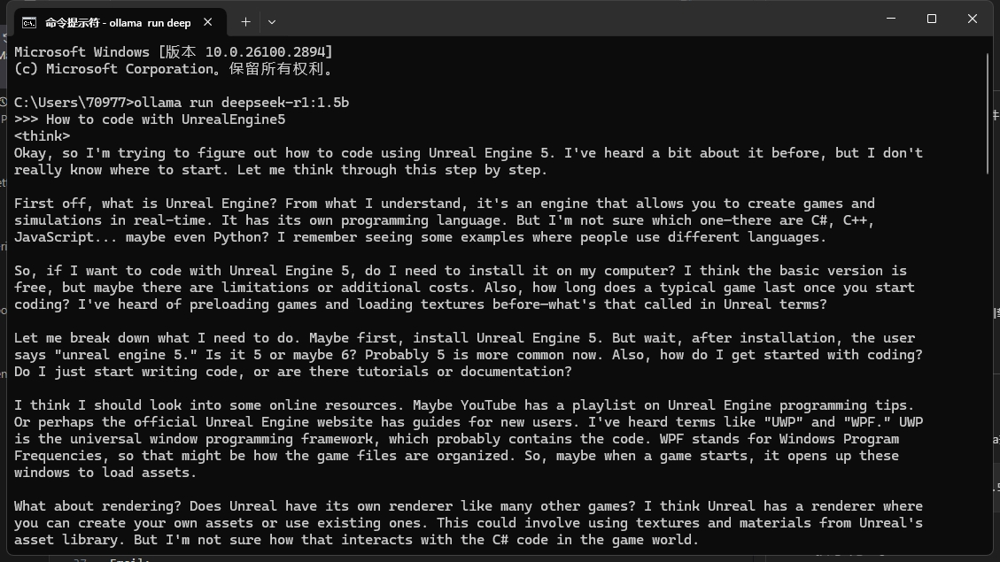
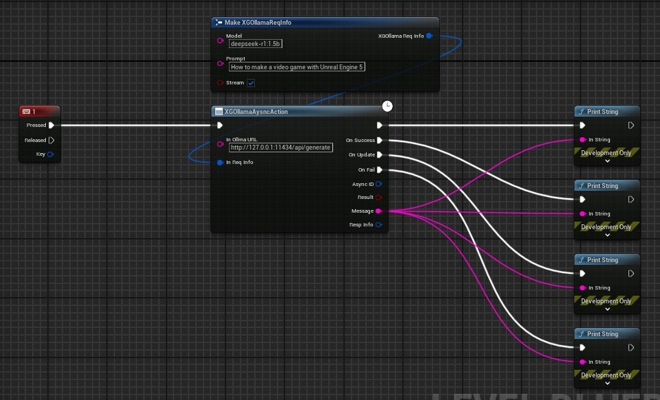
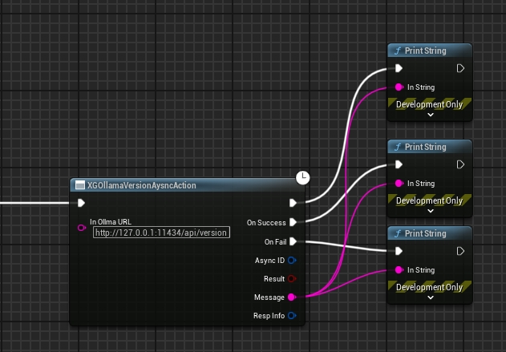

# XGOllamaLink
Plugin Version:1.0
- [XGOllamaLink](#xgollamalink)
  - [简介](#简介)
  - [代码库介绍](#代码库介绍)
    - [文件夹 DocumentPictures:](#文件夹-documentpictures)
    - [文件夹 XGDeepSeekDemo:](#文件夹-xgdeepseekdemo)
  - [使用流程](#使用流程)
    - [1.确认本地Ollama及模型运行正常](#1确认本地ollama及模型运行正常)
    - [2.通过蓝图节点进行访问](#2通过蓝图节点进行访问)
      - [Generate](#generate)
      - [Version](#version)
  - [联系方式](#联系方式)

## 简介
连接虚幻引擎5和Ollma的引擎插件</br>
英文文档:</br>
[English Instruction](./README.md)</br>
中文文档:</br>
[Chinese Instruction](./README_CN.md)</br>
商城链接:</br>
TODO </br>
注意:</br>
1.你需要在本地部署Ollama</br>
2.你需要下载需要访问的模型</br>
3.本插件由小刚开发,不包含虚幻引擎代码以外的任何代码,不会存储你的应用信息等</br>
## 代码库介绍
### 文件夹 DocumentPictures:  

文档中的各类图片  

### 文件夹 XGDeepSeekDemo:
UE_5.3的开发示例工程</br>
需要电脑上具备UEC++开发环境方可正常使用</br>
## 使用流程
### 1.确认本地Ollama及模型运行正常
你应该在本地服务器中部署Ollama并可以正常访问对话.
此处以Windows上通过命令行进行演示:
```
ollama run deepseek-r1:1.5b
```

  

### 2.通过蓝图节点进行访问

#### Generate
  
#### Version
  
## 联系方式

如果有任何XGOllamaLink插件产品问题,请联系我.  

QQ:
709777172  

Email:
709777172@qq.com  

bilibili:
[虚幻小刚](https://space.bilibili.com/8383085)  